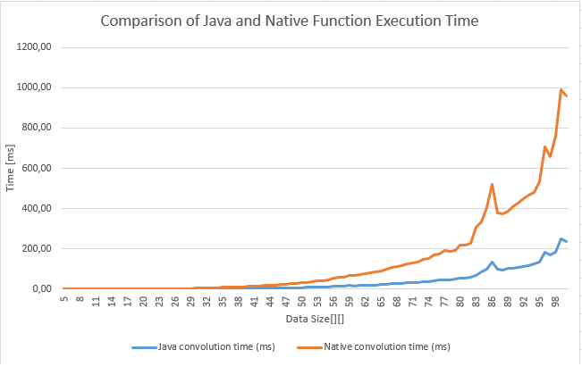

Podczas realizacji zadania Lab08 stworzono program, który korzystał z JNI. Zadanie polegało na stworzeniu klasy Java, która zawiera dwie metody obliczające dyskretną dwuwymiarową funkcję splotu - jedną w kodzie natywnym oraz drugą w kodzie normalnym - oraz przetestowanie ich działania.

Testowanie programu polegało na generowaniu problemu obliczeniowego i próbie rozwiązania go korzystając z obu zaimplementowanych metod. Testy wykonano dla rozmiarów 5x5-100x100, dla każdego rozmiaru wykonano 10 testów i wyciągnięto średni czas. 

Na podstawie wyników testów można stwierdzić, że w większości przypadków metoda natywna okazała się być mniej wydajna niż metoda normalna. Zauważono jednak pewne odstępstwa od tej reguły. Dla problemów o rozmiarze mniejszym niż 16x16 metoda natywna miała podobny czas a czasami była nawet szybsza.

| Size | Java convolution time (ms) | Native convolution time (ms) | Outputs match |
|------|---------------------------|-------------------------------|---------------|
5|0.0|0.1|true
6|0.0|0.1|true
7|0.2|0.0|true
8|0.1|0.0|true
9|0.1|0.1|true
10|0.3|0.0|true
11|0.2|0.0|true
12|0.2|0.2|true
13|0.2|0.1|true
14|0.3|0.3|true
15|0.4|0.2|true
16|0.0|0.5|true
17|0.2|0.5|true
18|0.1|0.8|true
19|0.0|1.0|true
20|0.4|1.1|true
21|0.4|1.1|true
22|0.6|1.2|true
23|0.5|2.1|true
24|0.6|2.0|true
25|0.9|2.3|true
26|0.8|3.6|true
27|0.9|3.5|true
28|0.9|3.9|true
29|1.1|4.1|true
30|1.6|5.3|true
31|1.6|6.1|true
32|1.4|6.6|true
33|1.8|6.7|true
34|2.1|7.5|true
35|2.3|9.8|true
36|2.5|10.5|true
37|2.7|10.3|true
38|2.8|11.4|true
39|3.2|12.0|true
40|3.7|13.5|true
41|3.9|14.8|true
42|4.4|16.4|true
43|4.5|18.0|true
44|5.4|19.9|true
45|5.3|21.5|true
46|5.7|24.0|true
47|6.6|25.9|true
48|7.0|28.0|true
49|7.6|29.9|true
50|8.2|32.2|true
51|8.7|35.0|true
52|9.3|37.8|true
53|10.9|40.4|true
54|11.3|44.0|true
55|12.2|48.2|true
56|14.6|56.5|true
57|14.8|59.1|true
58|14.8|58.5|true
59|17.5|67.2|true
60|16.9|69.3|true
61|18.1|71.5|true
62|18.8|75.4|true
63|20.3|81.4|true
64|21.9|84.2|true
65|23.1|90.8|true
66|24.3|98.5|true
67|27.7|109.4|true
68|28.6|113.6|true
69|30.3|119.2|true
70|31.3|125.2|true
71|33.3|132.2|true
72|35.1|135.9|true
73|37.5|146.0|true
74|39.1|151.7|true
75|42.9|171.5|true
76|44.3|174.6|true
77|48.3|190.8|true
78|47.0|187.6|true
79|50.3|194.4|true
80|56.4|217.9|true
81|55.0|218.5|true
82|58.0|227.8|true
83|70.3|305.7|true
84|84.8|332.4|true
85|99.4|404.9|true
86|133.1|519.6|true
87|98.6|376.6|true
88|96.9|374.2|true
89|102.6|386.3|true
90|104.4|410.8|true
91|107.8|427.9|true
92|112.6|451.1|true
93|115.2|467.3|true
94|126.0|481.5|true
95|136.2|533.4|true
96|183.5|705.8|true
97|170.6|657.7|true
98|182.9|761.4|true
99|251.6|990.3|true
100|238.7|958.0|true

