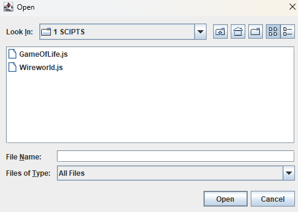
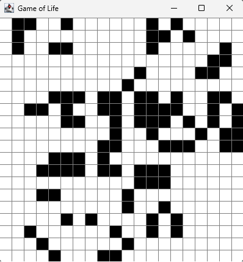

# Wybranie pliku

Po uruchomieniu programu pojawia nam się okno w którym wybieramy skrypt z którego będziemy korzystać:

# Wynik

Następnie pojawia się okienko wizualizujące wynik działania:

# Działanie

Na początku musimy wczytać silnik, odpowiada za to kod:

{

    private static ScriptEngine loadScriptEngine(String scriptFile) {
        try {
            ScriptEngineManager manager = new ScriptEngineManager();
            ScriptEngine engine = manager.getEngineByName("nashorn");
            if (engine == null) {
                System.out.println("Nashorn ScriptEngine is not available.");
                return null;
            }

            engine.eval(new FileReader(scriptFile));

            return engine;
        } catch (ScriptException | IOException e) {
            e.printStackTrace();
        }

        return null;
    }

}

Następnie inicjujemy planszę:

{

    ScriptEngine engine = loadScriptEngine(scriptFile);
        if (engine != null) {
            Invocable invocableEngine = (Invocable) engine;

            int[][] board = new int[100][100];
            int rows = 20;
            int cols = 20;

            invokeFunction(invocableEngine, "initialize", board, rows, cols);
        }
}

Po czym aktualizujemy ją w pętli:

{
    
    for (int i = 0; i < 100; i++) {
                invokeFunction(invocableEngine, "update", board, rows, cols);
                gameOfLifePanel.repaint();
                try {
                    Thread.sleep(500);
                } catch (InterruptedException e) {
                    e.printStackTrace();
                }
            }
}

# Skrypty w JS

Skrypty zawierają funkcje które później chcemy wywoływać w kodzie, np:

{

    var initialize = function(board, rows, cols) {
    for (var i = 0; i < rows; i++) {
        board[i] = new Array(cols);
        for (var j = 0; j < cols; j++) {
            board[i][j] = Math.random() > 0.5 ? 1 : 0;
        }
    }
    return board;
};

}
