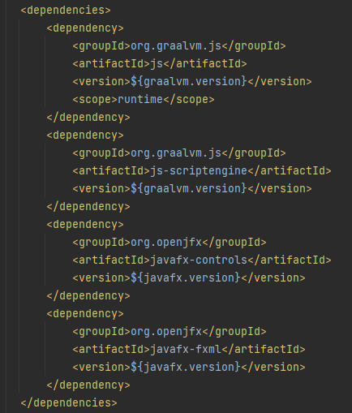
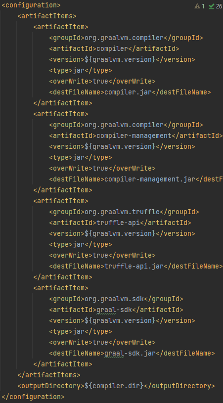
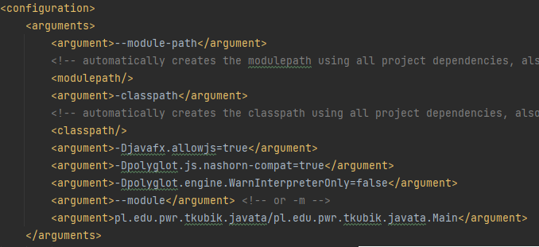
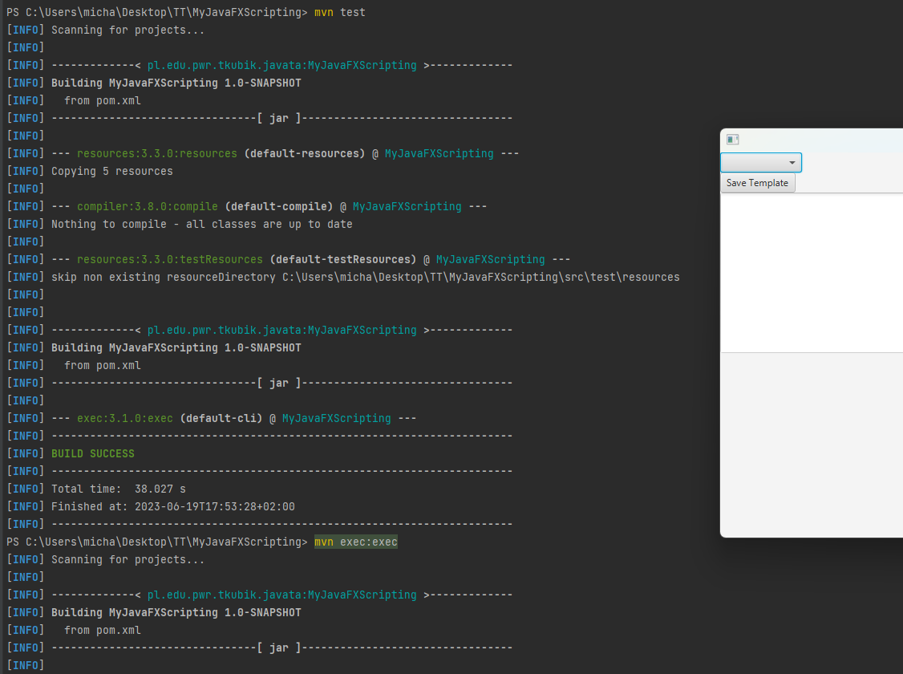

# Instrukcja

Otwórz swoje IDE (np. IntelliJ IDEA lub Eclipse).

Upewnij się, że masz zainstalowaną JDK w wersji 17 lub nowszej.

Skonfiguruj projekt jako projekt Maven (jeśli jeszcze tego nie zrobiłeś).

W pliku pom.xml dodaj odpowiednie zależności dla JavaFX, w tym również dla silnika. Przykładowy kod XML dla pliku pom.xml:

Dodaj wymagane parametry dla wirtualnej maszyny Java. 

Dodaj następujące parametry:

Skompiluj i zbuduj projekt za pomocą narzędzia Maven. Można to zrobić z poziomu wiersza poleceń, wpisując komendę mvn test.

Uruchom aplikację za pomocą narzędzia Maven, wpisując komendę mvn exec:exec.

